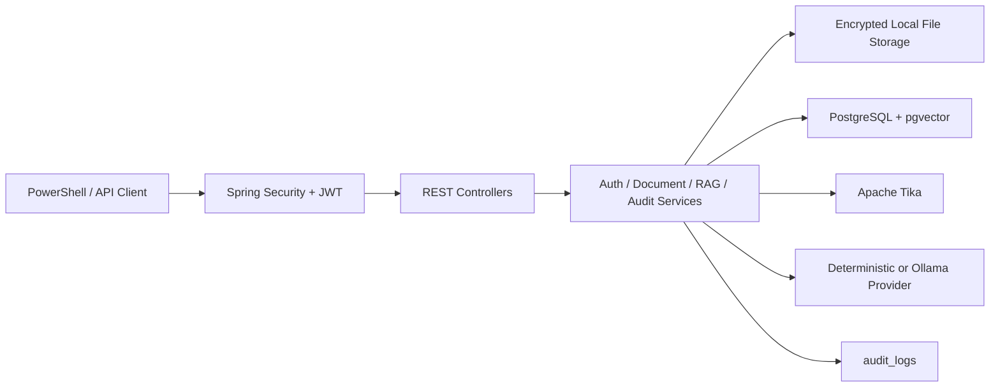

# Secure Vault AI

Secure Vault AI 是一个隐私优先的本地个人知识库系统，支持文件上传、AES-GCM 加密存储、Apache Tika 文本解析、chunking、embedding、pgvector 相似检索、RAG 问答、会话记录、用户隔离和 audit logs 审计日志。

## 项目价值

- 隐私优先：文件加密落盘，向量检索、RAG 问答和审计链路尽量在本地环境完成。
- 后端工程能力：覆盖认证、文件处理、数据库、向量检索、权限收口、安全脱敏、审计记录、Docker Compose 和自动化测试。
- AI 工程化：实现 embedding、pgvector 语义检索、RAG answer + sources 引用，不停留在普通 CRUD。
- 安全设计：使用 JWT、BCrypt、用户级数据隔离、AES-GCM 文件加密、响应脱敏和审计日志脱敏。
- 面试可展示：提供 Docker Compose、Maven 测试、PowerShell smoke 脚本、接口文档、演示脚本和简历答辩材料。

## 功能矩阵

| 能力 | 状态 | 说明 |
| --- | --- | --- |
| Auth / JWT | Completed | 用户注册、登录、JWT 鉴权、当前用户识别 |
| Document CRUD | Completed | 当前用户私有文档创建、列表、详情、更新、删除 |
| Docker + PostgreSQL | Completed | Docker Compose 启动后端和 pgvector PostgreSQL |
| File Upload | Completed | 支持 `pdf`、`docx`、`txt`、`md`、`markdown` 上传 |
| Tika Parsing | Completed | 使用 Apache Tika 抽取文档文本 |
| Chunking | Completed | 文本清洗、固定窗口与 overlap 分块、chunks 入库 |
| Embedding + pgvector | Completed | deterministic / Ollama embedding，pgvector 相似检索 |
| RAG QA | Completed | `/api/chat/ask` 返回 answer + sources |
| Conversation Memory | Completed | conversations 与 chat_messages 保存问答上下文 |
| File Encryption | Completed | 上传文件使用 AES-GCM 加密存储，读取时透明解密 |
| Access Control | Completed | `AccessControlService` 集中做用户资源归属检查 |
| Response Sanitization | Completed | 响应不暴露 `userId`、本地路径、stored filename、密钥、embedding 数组等 |
| Delete Cleanup | Completed | 删除文档时清理本地加密文件、chunks 和 embedding 数据 |
| Audit Logs | Completed | 记录认证、文档、embedding、RAG、访问拒绝、解密失败等安全事件 |
| Smoke Tests | Completed | 已有模块 6 到模块 9 PowerShell smoke 脚本 |

## 技术栈

- Backend：Java 17、Spring Boot 4.0.6、Spring Web MVC、Spring Data JPA
- Security：Spring Security、JWT、BCrypt、统一异常处理、用户级资源隔离
- Storage：本地文件存储、AES-GCM 加密、Apache Tika 文本抽取
- AI / RAG：文本清洗、chunking、embedding、pgvector、RAG prompt、answer + sources
- Database：PostgreSQL、pgvector、H2 测试数据库
- Deployment：Docker Compose、`.env` 环境变量、PowerShell 脚本
- Testing：Maven tests、Spring Security tests、模块 smoke tests、模块十文档静态验证
- Documentation：README、架构文档、API 指南、演示脚本、简历答辩材料、安全设计文档

## 系统架构

详细架构见 [docs/architecture.md](docs/architecture.md)。GitHub Markdown 支持在 fenced code block 中使用 `mermaid` 渲染图表，本文档中的架构图按该格式编写。



## 核心业务流程

- 注册登录流程：用户调用 `/api/auth/register` 提交 `username`、`email`、`password`，密码经 BCrypt 存储；登录调用 `/api/auth/login` 获取 JWT，后续请求使用 `Authorization: Bearer <token>`。
- 上传加密落盘流程：用户调用 `/api/documents/upload` 上传文件，服务端校验文件类型和大小，生成安全文件名，使用 AES-GCM 加密写入本地存储，并在 `documents` 表保存安全元数据。
- 解析分块流程：上传成功后自动触发解析，`FileStorageService` 透明解密文件流，Apache Tika 抽取文本，`TextChunkingService` 清洗并分块，写入 `document_chunks`。
- embedding 入库流程：用户调用 `/api/documents/{id}/embed`，系统对当前用户该文档的 chunks 生成 embedding，在 PostgreSQL + pgvector 中保存并更新文档 embedding 状态。
- RAG 问答流程：用户调用 `/api/chat/ask`，系统按当前用户范围检索相似 chunks，构造 RAG prompt，调用 deterministic 或 Ollama chat provider，返回 `answer` 和 `sources`，并写入 conversation 记录。
- 审计日志流程：认证、上传、解析、embedding、RAG、删除、跨用户访问失败、解密失败等事件写入 `audit_logs`；审计写入失败不会中断主业务。
- 跨用户访问拦截流程：服务层只按当前 JWT 解析出的 `userId` 查询资源，跨用户访问通过 `AccessControlService` 收口并返回 `404`，避免暴露资源是否存在。

## 快速启动

以下命令面向 Windows PowerShell。不要把 `.env`、`.secure-vault/`、真实密钥或真实 token 提交到仓库。

```powershell
git clone <your-repo-url>
cd C:\path\to\secure-vault-ai
```

创建本地 `.env`。可以先复制 `.env.example`，再替换本机私有配置：

```env
APP_PORT=8080
SPRING_PROFILES_ACTIVE=prod
POSTGRES_DB=securevault
POSTGRES_USER=securevault_user
POSTGRES_PASSWORD=replace-with-local-password
JWT_SECRET=replace-with-at-least-64-bytes-secret
JWT_EXPIRATION=86400000
FILE_STORAGE_DIR=/app/data/uploads
FILE_ENCRYPTION_ENABLED=true
FILE_ENCRYPTION_KEY=replace-with-base64-32-byte-key
MAX_FILE_SIZE=20971520
EMBEDDING_PROVIDER=deterministic
CHAT_PROVIDER=deterministic
```

也可以运行初始化脚本生成本地配置：

```powershell
.\scripts\setup.ps1
```

启动 Docker Compose：

```powershell
docker compose up -d --build
docker compose ps
docker compose logs backend --tail=200
```

运行 Maven 测试：

```powershell
cd C:\path\to\secure-vault-ai\backend
.\mvnw.cmd test
```

运行 smoke 脚本：

```powershell
cd C:\path\to\secure-vault-ai
powershell -ExecutionPolicy Bypass -File .\scripts\module9-smoke.ps1
```

## 测试说明

Maven 自动化测试：

```powershell
cd C:\path\to\secure-vault-ai\backend
.\mvnw.cmd test
```

模块九 Docker 冒烟测试：

```powershell
cd C:\path\to\secure-vault-ai
powershell -ExecutionPolicy Bypass -File .\scripts\module9-smoke.ps1
```

模块十文档静态验证：

```powershell
cd C:\path\to\secure-vault-ai
powershell -ExecutionPolicy Bypass -File .\scripts\module10-verify.ps1
```

成功时模块十脚本会输出：

```text
MODULE 10 DOCUMENTATION VERIFY PASSED
```

## 文档导航

- [docs/architecture.md](docs/architecture.md)：系统架构、数据流、安全链路和设计取舍。
- [docs/api-guide.md](docs/api-guide.md)：真实 Controller / DTO 对应的 API 使用文档。
- [docs/demo-script.md](docs/demo-script.md)：10 到 15 分钟面试或答辩演示脚本。
- [docs/resume-points.md](docs/resume-points.md)：中英文简历描述、技术亮点和面试 Q&A。
- [docs/module10-release-checklist.md](docs/module10-release-checklist.md)：模块十封版检查清单。
- [docs/privacy-design.md](docs/privacy-design.md)：隐私设计、安全边界和响应脱敏说明。
- [docs/audit-design.md](docs/audit-design.md)：审计日志设计、脱敏策略和验收方式。
- [docs/troubleshooting.md](docs/troubleshooting.md)：常见运行和演示故障处理。

## 安全注意事项

- 不提交 `.env`。
- 不提交 `.secure-vault/`。
- 不提交 `file-encryption.key` 的真实内容。
- 不在文档、Issue、提交信息或聊天记录里粘贴真实 JWT。
- 不在文档里粘贴真实本地文件路径。
- 不在文档里粘贴真实数据库密码。
- `.env.example` 只能保留占位符或可公开的默认值。
- 生产或演示环境使用稳定的 `JWT_SECRET` 和 `FILE_ENCRYPTION_KEY`，不要依赖临时控制台变量。

## 当前范围

Secure Vault AI 当前不包含复杂前端、OCR、多模态、Agent、团队协作权限、Redis、MQ 或 Elasticsearch。项目重点是把隐私优先的知识库后端主链路做完整，并能稳定演示认证、加密文件、解析、chunking、embedding、pgvector 检索、RAG、会话记录、用户隔离和审计日志。
