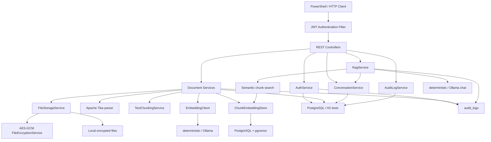
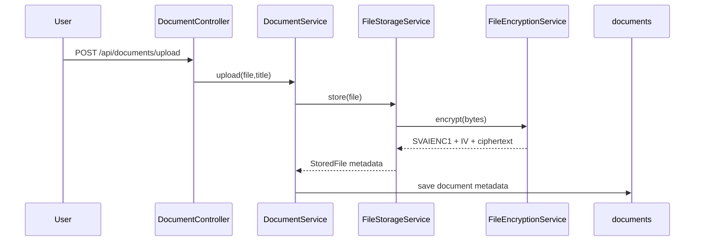
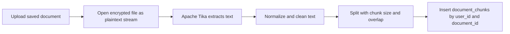
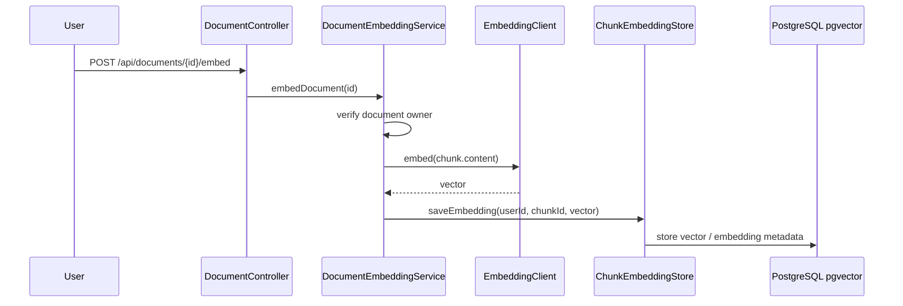
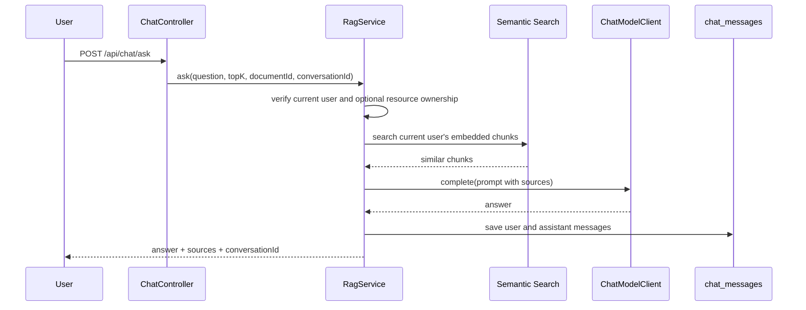
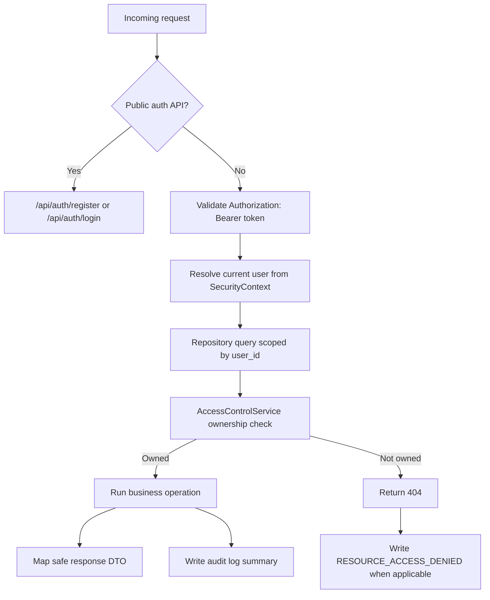

# Secure Vault AI Architecture

## 1. 系统定位

Secure Vault AI 是一个隐私优先的本地个人知识库后端。它把用户认证、文件加密存储、文档解析、文本分块、embedding、pgvector 相似检索、RAG 问答、会话记录、用户隔离和安全审计串成一条可运行、可测试、可演示的主链路。

项目当前只做后端与脚本演示，不包含复杂前端、团队协作或分布式基础设施。

## 2. 整体架构

## 3. 模块分层

| 层次 | 主要类 | 职责 |
| --- | --- | --- |
| Controller 层 | `AuthController`、`DocumentController`、`ChatController`、`ConversationController`、`AuditLogController` | 暴露 REST API，接收 DTO，返回 `ApiResponse` |
| Service 层 | `AuthService`、`DocumentService`、`DocumentParsingService`、`DocumentChunkService`、`DocumentEmbeddingService`、`RagService`、`ConversationService`、`AuditLogService` | 编排业务流程、事务、状态流转和错误处理 |
| Repository 层 | `UserRepository`、`DocumentRepository`、`DocumentChunkRepository`、`ConversationRepository`、`ChatMessageRepository`、`AuditLogRepository` | 按当前用户范围读写数据库 |
| Security 层 | `SecurityConfig`、`JwtAuthenticationFilter`、`JwtService`、`CurrentUserService`、`AccessControlService` | JWT 鉴权、当前用户解析、资源归属校验 |
| Document pipeline | `FileStorageService`、`FileEncryptionService`、`TikaDocumentTextParser`、`TextChunkingService` | 文件校验、加密落盘、透明解密、解析和分块 |
| RAG pipeline | `DocumentEmbeddingService`、`ChunkEmbeddingStore`、`RagPromptBuilder`、`ChatModelClient` | embedding、相似 chunk 检索、prompt 构造、answer + sources |
| Audit pipeline | `AuditLogService`、`AuditSanitizer`、`AuditLogController` | 写入安全事件，脱敏后给当前用户查询 |

## 4. 数据流图

### 文件上传到加密落盘

### 文件解析到 chunk 入库

上传文件后，`DocumentService.upload` 会自动调用 `DocumentParsingService.parseForUser`，解析成功后继续调用 `DocumentChunkService.chunkForUser`。

### chunk embedding 到 pgvector

### RAG ask 到 answer + sources

## 5. 安全链路图

关键安全规则：

- JWT 鉴权：除 `/api/auth/**` 外，所有接口默认需要登录。
- 当前用户识别：服务层通过 `CurrentUserService` 从 SecurityContext 获取用户，不接收客户端传入的 `userId`。
- `user_id` 过滤：文档、chunks、conversation、messages、audit logs 都按当前用户范围查询。
- 权限收口：`AccessControlService` 集中校验文档、会话和 chunk 归属。
- 跨用户访问返回 `404`：避免告诉攻击者资源是否存在。
- 响应脱敏：DTO 不返回本地路径、stored filename、`userId`、密钥、embedding 数组或完整 prompt。
- 审计记录：关键安全事件写入 `audit_logs`，并通过 `AuditSanitizer` 脱敏。

## 6. 数据库核心表

字段以当前实体为准，只列核心字段。

### `users`

| 字段 | 说明 |
| --- | --- |
| `id` | 主键 |
| `username` | 唯一用户名 |
| `email` | 唯一邮箱 |
| `password` | BCrypt 后的密码 |
| `role` | 用户角色 |
| `enabled` | 是否启用 |
| `created_at` / `updated_at` | 创建和更新时间 |

### `documents`

| 字段 | 说明 |
| --- | --- |
| `id` | 主键 |
| `user_id` | 文档所有者 |
| `title` / `description` | 文档标题和描述 |
| `status` | `CREATED`、`UPLOADED`、`PARSING`、`PARSED`、`CHUNKING`、`CHUNKED`、`EMBEDDING`、`EMBEDDED`、`FAILED` |
| `original_filename` / `stored_filename` / `file_path` | 原始文件名、服务端存储名、本地路径，响应 DTO 不暴露后两者 |
| `file_type` / `file_size` / `content_type` | 文件元数据 |
| `encrypted` / `encryption_algorithm` / `encryption_key_id` | 文件加密元数据 |
| `extracted_text` / `text_length` / `parsed_at` | 解析文本和解析状态 |
| `chunk_count` / `chunked_at` | 分块数量和时间 |
| `embedded_chunk_count` / `embedded_at` / `embedding_model` / `embedding_dimension` | embedding 状态 |
| `error_message` | 安全错误摘要 |
| `created_at` / `updated_at` | 创建和更新时间 |

### `document_chunks`

| 字段 | 说明 |
| --- | --- |
| `id` | 主键 |
| `user_id` / `document_id` | 所属用户和文档 |
| `chunk_index` | chunk 顺序 |
| `content` | chunk 文本 |
| `content_length` / `token_count` | 长度估算 |
| `content_hash` | chunk 内容 hash |
| `start_offset` / `end_offset` | 原文偏移 |
| `embedding_json` | H2 或测试环境使用的 embedding JSON |
| `embedding_model` / `embedding_dimension` / `embedded_at` | embedding 元数据 |
| `created_at` | 创建时间 |

### `conversations`

| 字段 | 说明 |
| --- | --- |
| `id` | 主键 |
| `user_id` | 会话所有者 |
| `title` | 会话标题 |
| `created_at` / `updated_at` | 创建和更新时间 |

### `chat_messages`

| 字段 | 说明 |
| --- | --- |
| `id` | 主键 |
| `conversation_id` / `user_id` | 所属会话和用户 |
| `role` | `USER` 或 `ASSISTANT` |
| `content` | 消息内容 |
| `sources_json` | RAG sources 快照 JSON |
| `created_at` | 创建时间 |

### `audit_logs`

| 字段 | 说明 |
| --- | --- |
| `id` | 主键 |
| `user_id` | 事件所属用户，登录失败等匿名事件可为空 |
| `action` | 审计动作 |
| `resource_type` / `resource_id` | 资源类型和资源 ID |
| `success` | 是否成功 |
| `message` | 脱敏安全摘要 |
| `ip_address` / `user_agent` | 请求来源摘要 |
| `created_at` | 创建时间 |

## 7. 关键设计取舍

- 为什么隐私优先：个人知识库会处理私有文件和问答内容，默认减少外部依赖可以降低泄露面，也便于本地演示。
- 为什么本地文件加密：即使上传目录或 Docker volume 被误共享，落盘文件仍不是明文；AES-GCM 同时提供机密性和完整性校验。
- 为什么使用 pgvector：它让向量检索直接进入 PostgreSQL，避免在作品阶段引入 Elasticsearch 或独立向量数据库，部署和讲解成本更低。
- 为什么审计日志必须脱敏：审计是安全可观测性，不应成为新的敏感数据泄露点，所以不记录 token、密钥、完整 prompt、embedding 数组、本地路径或数据库连接串。
- 为什么跨用户访问返回 `404` 而不是 `403`：`403` 会暗示资源存在但无权限，`404` 可以降低资源枚举风险。
- 为什么 deterministic provider 用于测试：自动化测试和 smoke 流程不应依赖 Ollama 是否已安装或模型是否下载，deterministic provider 让测试稳定可复现。

## 8. 当前不做的内容

- 复杂前端
- OCR
- 多模态
- 团队协作权限
- Agent
- Redis / MQ / Elasticsearch
- 管理员后台
- 多租户计费或配额系统
